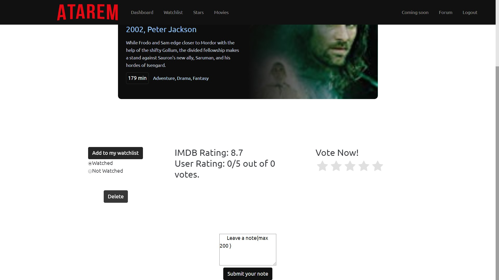
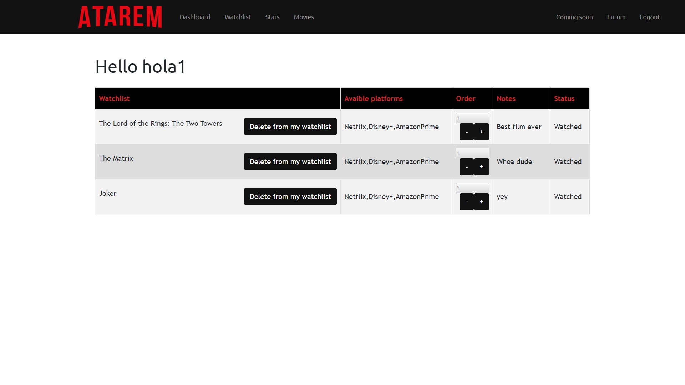

Parts Implemented by Atahan ÖZER
================================
This page will be providing information on

* *Watchlist page*
* *Coming soon page*
* *Starlist page*

1. Watchlist 
=====================

While using Atarem, users are going to be able to accomplish add movies to their watchlist from movies,keep notes with movies,find avaible platforms to watch ,keep the track of watch status and give order to movies .

1.1 Adding new movie and leaving a note
~~~~~~~~~~~~~~~~~~~~~~~~
Get to the route *https://itucsdb1965.herokuapp.com/movie/tt0167261/* and select watched or not watched and press to the add to my watchlist button.After the movie is added to watchlist you can leave a note .If you delete the movie it will be automaticly deleted from your watchlist.

.. note:: In order to route the link above you must be logged in.

.. warning:: You can not leave a note without adding it to watchlist.

	
1.2 Watchlist order ,status and notes 
~~~~~~~~~~~~~~~~~~~~~~~~
Get to the route *https://itucsdb1965.herokuapp.com/watchlist*.In this page it is possible to see movies which are added to  watchlist .You can give them a order so that you can see important movies at the top of your watchlist . You can read the notes of movies ,check their watch status and finaly you can reach to the platforms which you can watch the movie.
 

	
1.3 Deleting movie from watchlist 
~~~~~~~~~~~~~~~~~~~~~~~~
If you press the "Delete from my watchlist button" the movie will be deleted from your watchlist .

2. Coming soon page
=====================

